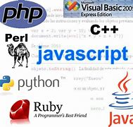

# Servidores
<html>
<head></head>
<body>
<table>
<td>

	<tr><a href=#servidores>*Servidores Web - </a></tr>
	<tr><a href=#socket>*Socket de Internet - </a></tr>
	<tr><a href=#servidor>*Servidor Base de Datos - </a></tr>
	<tr><a href=#xampp>*Xampp - </a></tr>
	<tr><a href=#lenguajes>*Lenguajes de Progrmaci&oacute;n Web - </a></tr>
	<tr><a href=#css>*CSS - </a></tr>
	<tr><a href=#caracteristicas>*Caracter&iacute;sticas B&aacute;sicas De Un Sitio Web - </a></tr>
	<tr><a href=#paginas>*P&aacute;ginas Responsivas - </a></tr>
	<tr><a href=#frame>*Frameworks - </a></tr>
	<tr><a href=#frame2>*Frameworks HTML5 Para Crear Webs - </a></tr>
	<tr><a href=#boot>*Bootstrap y Joomla</a></tr>

</td>	
</table>
	<a id=inicio align="center"><h1>Inicio</h1></a>

	<a id=servidores style="color:#0C1480" align="center"><h1>Servidores Web</h1></a>
	<h2 align="center">¿Qu&eacute; es un servidor web?</h2>
	

	
	

	
En inform&aacute;tica, un servidor web o Servidor HTTP es una pieza de software de comunicaciones que intermedia entre el servidor en el que est&aacute;n alojados los datos solicitados y el computador del cliente, permitiendo conexiones bidireccionales o unidireccionales, s&iacute;ncronas o as&iacute;ncronas, con cualquier aplicaci&oacute;n del cliente, incluso con los navegadores que traducen un c&oacute;digo traducible a una p&aacute;gina web determinada. O sea, se trata de programas que median entre el usuario de Internet y el servidor en donde est&aacute; la informaci&oacute;n que solicita.

	<h2 align="center">Caracter&iacute;sticas De Un Servidor Web</h2>
	
Un servidor web opera en un ordenador aguardando las solicitudes de parte del navegador web de un cliente, brindando los datos solicitados para componer una p&aacute;gina web o, en su defecto, un mensaje de error. Los servidores web pueden ser de dos clases: est&aacute;ticos y din&aacute;micos. 

	
*Los servidores est&aacute;ticos. Consisten en un computador en donde est&aacute; almacenada la informaci&oacute;n y un servidor HTTP que responde a los protocolos de pedido. 

	
Los servidores din&aacute;micos. En cambio son servidores est&aacute;ticos que contienen software adicional (usualmente aplicaciones y bases de datos) que les permiten actualizar la informaci&oacute;n solicitada antes de enviarla al cliente.

	<h2 align="center">¿Para qu&eacute; Sirve Un Servidor Web?</h2>
	
La funci&oacute;n de los servidores web es la de mediar entre las solicitudes de los usuarios y los archivos que contienen la informaci&oacute;n solicitada, en el computador en el que est&aacute;n almacenados

	
*El usuario introduce una direcci&oacute;n web (URL) en su navegador y &eacute;ste env&iacute;a una solicitud al servidor web.

	
*El servidor web (software) busca los archivos pertinentes ya sea en el propio servidor (hardware) o en un servicio de hosting en el que est&aacute;n siempre disponibles y en l&iacute;nea.

	
*Los archivos entonces son procesados seg&uacute;n lo solicitado y enviados de acuerdo al protocolo de transferencia, es decir, conforme a un conjunto de reglas que regulan la comunicaci&oacute;n entre los computadores.

	
*El navegador recibe los archivos y ensambla el contenido de la p&acute;gina web que se muestra al usuario.

	<h2 align="center">Servidores Web M&aacute;s Utilizados</h2>
	
Nginx (2004). Un servidor web y Proxy desarrollado por la empresa hom&oacute;nima.

	
Apache (1995). Es un servidor web HTTP de c&oacute;digo abierto, que sirve para computadores Unix, Windows y Macintosh, desarrollado y mantenido por una comunidad de usuarios que conforman la Apache Software Foundation.

	
Internet Information Services o IIS (1993). Servidor web y conjunto de servicios dise&ntilde;ados para Microsoft Windows que fue originalmente incluido en su versi&oacute;n NT.

	
Cherokee (2001). Es un servidor web multiplataforma escrito en lenguaje C, disponible bajo Licencia Pública General de GNU, de software libre.

	
Tomcat (1999). Una distribución de Apache conocida también como Jakarta Tomcat, opera bajo el principio de los servlets (Java).

	

	
	

	<tr><a href=#inicio>Inicio</a></tr>
	

	<a id=socket style="color:#6C0B0D"><h1>Socket de Internet</h1></a>
	
Socket designa un concepto abstracto por el cual dos procesos (posiblemente situados en computadoras distintas) pueden intercambiar cualquier flujo de datos, generalmente de manera fiable y ordenada. El t&eacute;rmino socket es tambi&eacute;n usado como el nombre de una interfaz de programación de aplicaciones (API) para la familia de protocolos de Internet TCP/IP, provista usualmente por el sistema operativo. Los sockets de Internet constituyen el mecanismo para la entrega de paquetes de datos provenientes de la tarjeta de red a los procesos o hilos apropiados. Un socket queda definido por un par de direcciones IP local y remota, un protocolo de transporte y un par de n&uacute;meros de puerto local y remoto.

	
Para que dos procesos puedan comunicarse entre sí es necesario que se cumplan ciertos requisitos: Que un proceso sea capaz de localizar al otro. *Que ambos procesos sean capaces de intercambiarse cualquier secuencia de octetos, es decir, datos relevantes a su finalidad. Para ello son necesarios los dos recursos que originan el concepto de socket: *Un par de direcciones del protocolo de red (direcci&oacute;n IP, si se utiliza el protocolo TCP/IP), que identifican la computadora de origen y la remota. *Un par de n&uacute;meros de puerto, que identifican a un programa dentro de cada computadora. Los sockets permiten implementar una arquitectura cliente-servidor. La comunicaci&oacute;n debe ser iniciada por uno de los procesos que se denomina programa "cliente". El segundo proceso espera a que otro inicie la comunicaci&oacute;n, por este motivo se denomina programa "servidor". Un socket es un proceso o hilo existente en la m&aacute;quina cliente y en la m&aacute;quina servidora,
	que sirven &uacute;ltima instancia para que el programa servidor y el cliente lean y escriban la informaci&oaute;n. Esta informaci&oacute;n será la transmitida por las diferentes capas de red.

	<tr><a href=#inicio>Inicio</a></tr>
	

	

	<a id=servidor style="color:#047D37"><h1>Servidor Base de Datos</h1></a>
	
	<h2>¿Qu&eacute; Es Un Servidor Web De Base De Datos</h2>
	

	
Un servidor de base de datos, también conocido como database server o RDBMS (Relational DataBase Management Systems) en caso de bases de datos relacionales, es un tipo de software de servidor que permiten la organizaci&oacute;n de la informaci&oacute;n mediante el uso de tablas, &iacute;ndices y registros.

	
Si vamos a la función fundamental de un servidor de base de datos, encontraremos que es el servicio que provee de informaci&oacute;n a otras aplicaciones web o equipos/hosts, tal como se especifica en el modelo cliente servidor.

	
*Administración de registros de personas: el uso de software para registros médicos, así como fichas de perfiles de clientes en clínicas, centros de odontología y más, es algo muy común de ver.
	 *Administraci&oacute;n de documentos: sirve para organizar documentos de texto de diversa índole, algo muy usado en las diferentes empresas.
	 *Administraci&oacute;n contable e impositiva: el uso de base de datos en estudios contables mejora el manejo de facturas, pagos de impuestos, gastos, ingresos y egresos.
	 *Indexación de sitios web: el caso m&aaacute;s popular del mundo es Google con su inmensa base de datos para indexar, gestionar y modificar los aspectos de sitios webs en sus resultados.
	 *Servir contenido din&aacute;mico: con el auge del servidor PHP y la programaci&oacute;n web, se comenzaron a usar las bases de datos para servir datos de foros, CMS, administraciones de usuarios, gestores de contenidos (como WordPress) y m&aacute;s.

	<h2 align="center">Servidor De Base De Datos</h2>
	 *MySQL server -- Base de datos de código abierto muy popular, pequeña y rápida.
	 *PostgreSQL server -- Base de datos de código abierto, es un servidor de base de datos relacional orientada a objeto publicado bajo licencia libre BSD.
	 *Oracle-XE -- Versión "lite" del RDBMS de Oracle (gratuita pero no de código abierto).
	

	
	

	<tr><a href=#inicio>Inicio</a></tr>
	

	

	<a id=xampp style="color:#E75A02"><h1>Xampp</h1></a>
	
	
XAMPP es un paquete de software libre, que consiste principalmente en el sistema de gesti&oacute;n de bases de datos MySQL, el servidor web Apache y los int&eacute;rpretes para lenguajes de script PHP y Perl. El nombre es en realidad un acr&oacute;nimo: X (para cualquiera de los diferentes sistemas operativos), Apache, MariaDB/MySQL, PHP, Perl. A partir de la versi&oacute;n 5.6.15, XAMPP cambi&oacute; la base de datos MySQL por MariaDB, un fork de MySQL con licencia GPL.
	 El programa se distribuye con la licencia GNU y act&uacute;a como un servidor web libre, f&aacute;cil de usar y capaz de interpretar p&aacute;ginas din&aacute;micas. A esta fecha, XAMPP est&aacute; disponible para Microsoft Windows, GNU/Linux, Solaris y Mac OS X.

	<tr><a href=#inicio>Inicio</a></tr>
	

	<a id=lenguajes style="color:#3E038A"><h1>Lenguajes de Progrmaci&oacute;n Web</h1></a>
	
	
Lenguaje de Programaci&oacute;n Web.Los lenguajes de programaci&oacute;n Web han ido surgiendo seg&uacute;n las necesidades de las plataformas, intentando facilitar el trabajo a los desarrolladores de aplicaciones. Se clasifican en lenguajes del lado cliente y lenguajes del lado servidor.

	<h2 align="center">Ejemplos de Lenguajes Web</h2>
	
*Html *Javascript *Hojas de estilo en cascada

	<h2 align="center">Lenguajes Del Lado Servidor</h2>
	
*PHP *PHP5

	
	

	<tr><a href=#inicio>Inicio</a></tr>
	

	

	<a id=css style="color:#0C1480"><h1>CSS</h1></a>
	
(Cascading Style Sheets, u Hojas de Estilo en Cascada) es la tecnolog&iacute;a
	desarrollada por el World Wide Web Consortium (W3C) con el fin de separar la estructura de la presentaci&oacute;n. A pesar de que la recomendaci&oacute;n
	oficial del grupo de trabajo de la W3C ya hab&iacute;a alcanzado la estabilidad requerida para que fuera soportada por los
	principales navegadores comerciales, como Netscape e Internet Explorer, tan
	tempranamente como en el año 1998, la situación de entonces, com&uacute;nmente conocida
	como la “guerra de los navegadores”, hac&iacute;a que los intereses comerciales de
	las dos compa&ntilde;%iacute;as en lucha por el mercado de usuarios de Internet se interpusieran
	en el camino de las CSS.

	<tr><a href=#inicio>Inicio</a></tr>
	

	<a id=caracteristicas style="color:#6C0B0D"><h1>Caracter&iacute;sticas B&aacute;sicas De Un Sitio Web</h1></a>
	<h3>Encabezado</h3>
	
*Logotipo (no borroso, no mal recortado, no pixeleado) *Bajo el logotipo, una frase corta que indique exactamente a qu&eacute; se dedica tu empresa. Por ejemplo bajo nuestro logotipo dice “Dise&ntilde;o y desarrollo de p&aacute;ginas y aplicaciones web”.

	<h3>Barra de Navegaci&oacute;n</h3>
	
Debe permanecer en el mismo lugar en todas las p&aacute;ginas interiores, aunque puede estar en otro lugar en la portada si hay una buena justificaci&oacute;n. Al estar siempre en el mismo lugar el visitante sabe en todo momento donde buscar las dem&aacute;s opciones

	<h3>Area de contenido principal</h3>
	
Es el &aacute;rea donde la vista del visitante va despu&eacute;s de ojear r&aacute;pidamente el encabezado. Aqu&iacute; debes poner tu informaci&oacute;n.

	<h3>Barra lateral de contenido</h3>
	
En algunos casos es muy &uacute;til tener una barra lateral, en la cual se puede colocar informaci&oacute;n de f&aacute;cil acceso, como n&uacute;meros telef&oacute;nicos o una liga a nuestro formulario de cotizaciones.

	<h3>Pie De P&aacute;gina</h3>
	
Debe contener un men&uacute; alterno en puro texto, con las opciones de primer nivel. Tambi&eacute;n &uacute;salo para colocar información de contacto u otra informaci&oacute;n importante. El contenido del pie debe aparecer en todas las p&aacute;ginas.

	<tr><a href=#inicio>Inicio</a></tr>
	

	

	<a id=paginas style="color:#047D37"><h1 align="center">P&aacute;ginas Responsivas</h1></a>
	
Las estrategias de marketing que consideran el uso optimizado de su informaci&oacute;n para m&oacute;viles, o lo que llamamos Responsive Design,  tienen altos &iacute;ndices de efectividad tanto para el posicionamiento en buscadores como para lograr conversiones y ventas. Responsive design se refiere a la capacidad de un sitio web para adaptarse a cualquier dispositivo que use el visitante. 

	<tr><a href=#inicio>Inicio</a></tr>
	

	<a id=frame style="color:#E75A02"><h1 align="center">Frameworks</h1></a>
	
Un entorno de trabajo1 (del ingl&eacute;s framework), o marco de trabajo es un conjunto estandarizado de conceptos, pr&aacute;cticas y criterios para enfocar un tipo de problem&acute;tica particular que sirve como referencia, para enfrentar y resolver nuevos problemas de &iacute;ndole similar.
	 En el desarrollo de software, un entorno de trabajo es una estructura conceptual y tecnol&oacute;gica de asistencia definida, normalmente, con artefactos o m&oacute;dulos concretos de software, que puede servir de base para la organización y desarrollo de software. T&iacute;picamente, puede incluir soporte de programas, bibliotecas, y un lenguaje interpretado, entre otras herramientas, para así ayudar a desarrollar y unir los diferentes componentes de un proyecto.
	 Representa una arquitectura de software que modela las relaciones generales de las entidades del dominio, y provee una estructura y una especial metodolog&iacute;a de trabajo, la cual extiende o utiliza las aplicaciones del dominio.​

	<tr><a href=#inicio>Inicio</a></tr>
	

	

	<a id=frame2 style="color:#3E038A"><h1>Frameworks HTML5 Para Crear Webs</h1></a>
	
	
*Twitter Bootstrap *Foundation *Skeleton *HTML5 Boilerplate *HTML KickStart *Montage HTML5 Framework

	
	<tr><a href=#inicio>Inicio</a></tr>
	

	<a id=boot style="color:#0C1480"><h1>Bootstrap y Joompla</h1></a>
	<table border="1">
  		<tr>
    			<th>Bootstrap</th>
    			<th>Joomla</th>

  		</tr>
  		<tr>
    			<td>Este framework facilita enormemente la maquetaci&oacute;n de p&aacute;ginas web,  ya que te permite crear una interfaz muy limpia y completamente  responsive, es decir, adaptable a cualquier tama&ntilde;o de pantalla.</td>
	    		<td>Permite crear, modificar o eliminar contenido de un sitio web de manera  sencilla a trav&eacute;s de un "panel de administraci&oacute;n".</td>
  		</tr>
	</table>
	

	<tr><a href=#inicio>Inicio</a></tr>
 

</body>
</html>
